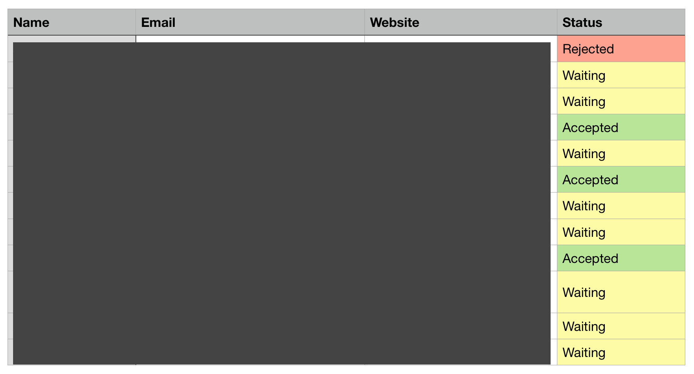

# How I Got My First Internship and How You Can Too

Let me take you back to June last year when I was finishing up with my first year of Computer Science exams. I was really worried because I had been putting off looking for an internship over Summer. I wanted to get some experience during my break, so I set out on an intense plan to find a placement.

In this post, I'll outline the steps that I went through to find a company that would offer me a placement. Hopefully, you can take these steps to help you with your own internship search.

## 1. Research potential placements

After my exams, I spent several days straight researching potential places to work.

The majority of smaller companies will not outright ask for interns. As a result, it's important to know that **you** need to put in the effort to get in contact with companies.

I used job websites like indeed.com and LinkedIn to look for normal jobs that have a similar area of experience that I have or want to expand on.

As a data nerd, I made a spreadsheet of companies that I could work for. Even if I didn't want to work at a particular place I'd put it in the spreadsheet for completion.

_A preview of part of my spreadsheet_

I ended up having a list of over 10 companies. The more places you ask the higher your chance of getting a response. Quantity is important, especially if you live in an area like me where there are not that many tech opportunities available.

## 2. Reaching out

After making my spreadsheet, the next step was to contact all of the companies that interest you.

While you could phone a company, email is much preferred. This will give you time to plan what you want to say as best as you can. It also lets whoever receives the email to reply back when they get the time.

Since a lot of emails are of the same format, I found it would be easier to build an email template. My template contained information including who I was, why I was contacting them and what I could do for them.

Now here is the most important part. Rather than sending the same email to each company talking about why you're so great (I'm sure you are), don't forget that there's a person on the other side of the email. People can spot the difference between a spam email and a genuine one. That's why it's important to tailor your email and make it as custom to the company as possible. This involves being honest and saying why you like the company, why you would be a good fit and what you could offer them.

If you want an idea of what you can write, here is the email template I used:

> Dear Sir/Madam,
>
> My name is Pav Sidhu from Cardiff. I am currently an undergraduate Computer Science student at the University of Birmingham. I finish university at the end of June and I am looking for an internship opportunity over Summer.
>
> (Insert why I like the company, why I would be a good fit and what you could do for them.)
>
> I have several years of web development experience which I have outlined on the attached CV however to outline my technological skills:
>
> Front-end: HTML, CSS/SASS, Javascript (ES6, React, jQuery, AJAX)
> Back-end: Node.js, Python, Java, SQL, GraphQL
>
> I appreciate you taking the time to read this, I would love to spend 15 minutes or so to discuss such an opportunity.
>
> Regards,
>
> Pav Sidhu
>
> Phone: +01 2345 67890
>
> Website: [https://pavsidhu.com](https://pavsidhu.com/)
>
> Blog: [https://blog.pavsidhu.com](https://blog.pavsidhu.com/)
>
> GitHub: <https://github.com/pavsidhu>

Remember to keep your email short and sweet, the person reading this doesn't want to hear about all your achievements, no matter how great they are.

Lastly, proofread your emails. I used [Grammarly](grammarly.com) to check for grammar errors and [Hemingway editor](http://www.hemingwayapp.com/) to ensure my writing was clear.

Don't forget to attach your CV so if a company is interested they read more about your skills in more detail. I can't tell you how many times I almost forgot to attach mine 😅.

I sent my emails on Sunday night. This means that on Monday morning, the first thing they see will be your email. Unless you have to, try not to send it on any other day. Even if you may have been a great fit they wouldn't know because they might miss your email!

## 3. Waiting for a response

The first thing to note is that a potential intern is not a companies number one priority so don't always expect a reply back any time soon. To be safe I would wait a week or two for a response. If you don't receive anything, send a polite email asking if they received your email.

Not all companies have the time to respond so only a few, if any, will reply.

If you have gotten a response, you will likely send a few emails back and forth to discuss a potential phone call or meeting to see if you are a good fit.

I was lucky when getting my internship. I was called into the office to have a chat to see what I could do for the company and what I could get out of it. Small companies are less predictable, so some companies may have an interview process while others may not.

If everything works out you've got yourself an internship, congrats! 🎉🎉🎉

## 4. One Last Controversial Point

Working for free is not something that everybody agrees on. I believe that you shouldn't feel entitled to be paid a salary if you have little to no experience.

If you can afford it and you enjoy what you're doing, you should be happy working for free. The company is doing you a favour by taking a risk and giving you experience.

As a student, I know the importance of money however it doesn't get easier when you're older with a mortgage and bills. Take the opportunity now to get experience while you can, it'll help you out in the long run.

If you or the company you work for thinks you are doing a good job, you could discuss potential pay with them.

## Some Final Tips

- Although I procrastinated and left my search till late, start your search early. You will have a greater chance of getting an internship, especially if you're going for bigger companies, though that's a different game altogether.
- If you can do your work without much support from others, startups are more likely to take you on. As startups are usually growing at a rapid pace, they need all the help they can get. If you have the skills they will be keen to have you join their team.
- Be polite, remember that someone is taking time out of their busy work schedule to help you.
- Getting an internship is hard, my internship success came with a mix of hard work and luck. If a company ignores or rejects you, don't feel discouraged its part of the process.

Good luck with your search! I would love to hear if you manage to get an internship. Send me a message on Twitter @Pav_Sidhu 😄.